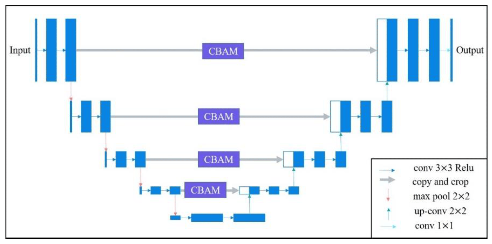
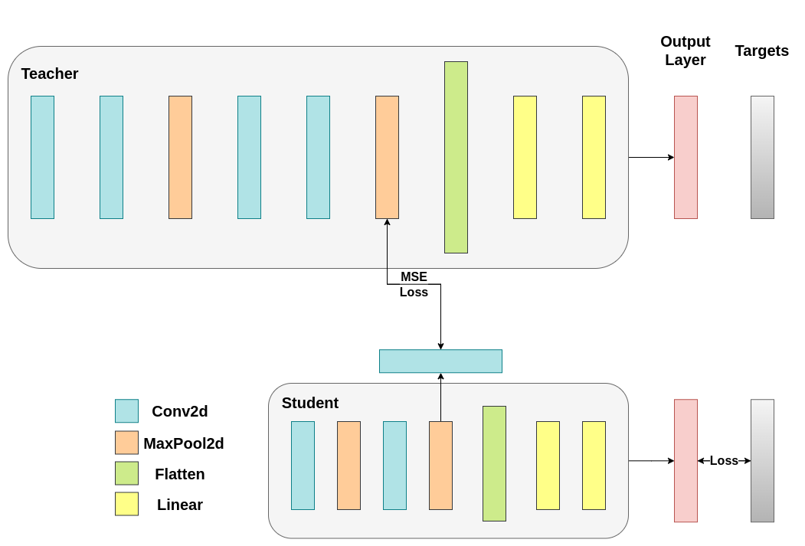

# Noisy-Student for Label Noise Detection

This project aims to detect noise in labels from the DataCentric Kaggle dataset using a Teacher-Student network approach. The models used are modified U-Net architectures (NRN-RSSEG) with Mean Squared Error (MSE) as the distillation loss.

<p align="center">
  
</p>
Example of the NRN-RSSEG architecture used in the project [1]

## Project Structure

- `train_teacher.py`: Script to train the Teacher model.
- `train_student.py`: Script to train the Student model using the Teacher model for knowledge distillation.
- `inference.py`: Script to perform inference using the trained Student model.
- `dataloader.py`: Contains data loading utilities for both Teacher and Student models.
- `models/`: Directory containing the model definitions.
- `loss_function.py`: Contains custom loss functions used in training.
- `config.yaml`: Configuration file for training parameters.

## Training Process

### Teacher Model

1. **Data Preparation**: The data is loaded and preprocessed using the `TeacherDataModule` class. The clean dataset used is from [WHU Building Dataset](https://www.kaggle.com/datasets/xiaoqian970429/whu-building-dataset) and [Alabama Buildings Segmentation](https://www.kaggle.com/datasets/meowmeowplus/alabama-buildings-segmentation).
2. **Model Initialization**: The `NRNRSSEGTeacher` model is initialized.
3. **Training**: The model is trained using the Symmetric Cross Entropy (SCE) loss function.
4. **Validation**: The model is validated after each epoch, and the best model is saved based on validation loss.

### Student Model

1. **Data Preparation**: The data is loaded and preprocessed using the `StudentDataModule` class. The noisy dataset used is from the [DataCentric Kaggle dataset](https://www.kaggle.com/competitions/data-centric-land-cover-classification-challenge/data).
2. **Model Initialization**: The `NRNRSSEGStudent` model is initialized.
3. **Knowledge Distillation**: The Student model is trained using the Teacher model's feature maps with Mean Squared Error (MSE) as the distillation loss. Then, the loss is calculated as a weighted sum of the distillation loss and the SCE loss from the noisy labels. 

<p align="center">
  
</p>

Knowledge distillation process used in the project [2]

4. **Validation**: The model is validated after each epoch, and the best model is saved based on validation loss.

## Inference

The `inference.py` script is used to perform inference using the trained Student model. The script loads the model, preprocesses the input images, and saves the output predictions.

## Configuration

The `config.yaml` file contains all the necessary configuration parameters for training and inference, including paths to data, normalization parameters, and training hyperparameters.

## Experimentation Logs

Experimentation logs, including training and validation metrics, are logged using Weights & Biases (W&B). You can view the logs and visualizations [here](https://wandb.ai/scigeo/RSSEG-UNet-Teacher-Student-Training).

## Running the Scripts

### Training the Teacher Model

```bash
nohup python train_teacher.py config.yaml > logs/teacher_training.log 2>&1 &
```

### Training the Student Model

```bash
nohup python train_student.py config.yaml > logs/student_training.log 2>&1 &
```

### Performing Inference

```bash
python inference.py
```

## Requirements

- Python 3.8+
- PyTorch
- PyTorch Lightning
- OpenCV
- scikit-learn
- Weights & Biases
- Typer

Install the required packages using:

```bash
pip install -r requirements.txt
```

## References
[1] "NRN-RSSEG: A Deep Neural Network Model for Combating Label Noise in Semantic Segmentation of Remote Sensing" by Xi, M., Li, J., He, Z., Yu, M., & Qin, F. (2023). [Link to the paper](https://doi.org/10.3390/rs15010108).

[2] "Knowledge Distillation Tutorial". Chariton Alexandros (2023). [Available in web](https://pytorch.org/tutorials/beginner/knowledge_distillation_tutorial.html)